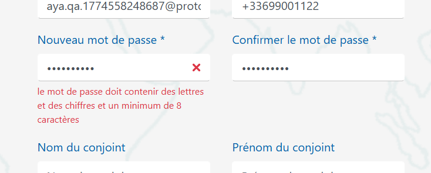
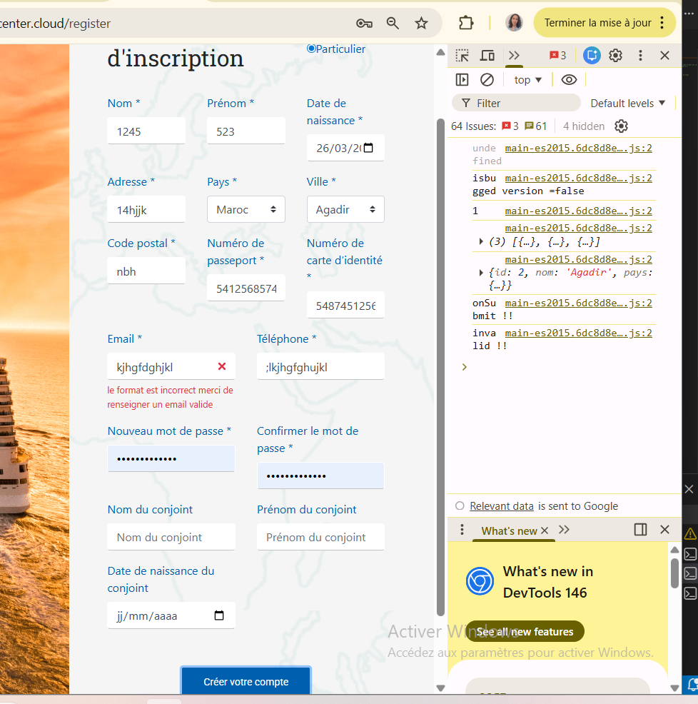
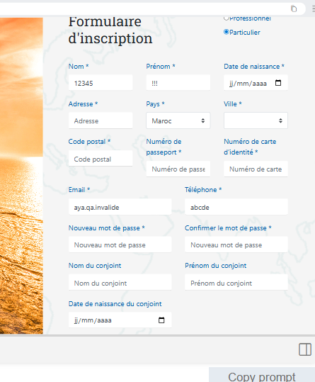

# 🐞 Rapport d'Anomalies (Bugs Found)

Ce document récapitule les dysfonctionnements identifiés lors des tests automatisés et manuels sur le formulaire d'inscription OpenCruise.

---

## 🔴 Anomalie 01 : Fausse Alerte de Validation Password
**Statut :** Ouvert | **Priorité :** Haute | **Type :** UI/UX Bug

### Description
Le système affiche un message d'erreur "le mot de passe doit contenir des lettres..." même lorsque l'utilisateur saisit un mot de passe valide respectant tous les critères (Majuscule, chiffre, 8+ caractères). 

### Preuve (Screenshot)

*(Note: Le mot de passe contient bien des points, indiquant une saisie complexe, mais l'erreur persiste- Passw0rdAdmin)*.

### Impact
L'utilisateur est induit en erreur et peut abandonner le processus d'inscription car il pense que son mot de passe est invalide.

---

## 🟠 Anomalie 02 : Absence de Validation du Format Email (Real-time)
**Statut :** Ouvert | **Priorité :** Moyenne | **Type :** Functional Bug

### Description
Bien qu'un message d'erreur s'affiche ("le format est incorrect"), le champ accepte des saisies incohérentes dans la console ou ne bloque pas immédiatement l'interaction de manière stricte.

### Preuve (Screenshot)

*(Note: Saisie de caractères aléatoires "kjhgfdghjkl" sans structure d'email valide)*.

### Impact
Risque de pollution de la base de données avec des adresses emails non fonctionnelles si la validation côté serveur n'est pas renforcée.

---

## 🟡 Anomalie 03 : Absence de Masquage de Caractères Spéciaux (Nom/Prénom)
**Statut :** Ouvert | **Priorité :** Faible | **Type :** Data Integrity

### Description
Les champs "Nom" et "Prénom" acceptent des chiffres (ex: "1245") et des caractères spéciaux (ex: "!!!") sans déclencher d'alerte immédiate.

### Preuve (Screenshot)

*(Note: Le prénom est rempli avec "!!!" et le nom avec "12345")*.

### Impact
Mauvaise qualité des données utilisateur recueillies.

---

## 🔴 Anomalie 04 : Absence de Contrôle sur le champ Téléphone
**Statut :** Ouvert | **Priorité :** Haute | **Type :** Functional Bug

### Description
Le champ "Téléphone" accepte la saisie de caractères alphabétiques et de symboles au lieu de restreindre l'entrée uniquement aux caractères numériques. 

### Preuve (Screenshot)

*(Note: Saisie de ";lkjhgfhuikl" dans le champ téléphone sans aucun blocage ni message d'erreur spécifique au format numérique)*.

### Impact
* **Données erronées** : Impossibilité de contacter le client par la suite.
* **Sécurité** : Risque d'injection si les caractères spéciaux ne sont pas filtrés côté serveur.

### Recommandation
Appliquer une validation stricte (Regex) ou utiliser un input de type `tel` avec un filtre `pattern="[0-9]*"` pour empêcher la saisie de lettres dès l'interface utilisateur.
---

## 🟠 Anomalie 05 : Absence de Validation du Code Postal
**Statut :** Ouvert | **Priorité :** Moyenne | **Type :** Functional Bug

### Description
Le champ "Code postal" accepte la saisie de caractères alphabétiques (ex: "nbh") sans déclencher d'erreur de format, alors qu'il devrait être restreint aux chiffres selon les standards postaux.

### Preuve (Screenshot)

*(Note: Saisie de "nbh" acceptée pour la ville d'Agadir, Maroc)*.

### Impact
Risque d'erreurs logistiques et de données incohérentes dans le profil utilisateur.

### Recommandation
Ajouter une validation `pattern="[0-9]*"` ou une vérification basée sur le pays sélectionné pour garantir un format de code postal valide.
---
## 🛠️ Recommandations Techniques
1. **Password** : Revoir la Regex de validation dans le composant Angular pour déclencher le `onKeyUp` correctement.
2. **Email** : Implémenter une validation HTML5 `type="email"` plus stricte.
3. **Input Masking** : Ajouter des filtres pour n'autoriser que les caractères alphabétiques dans les champs d'identité.